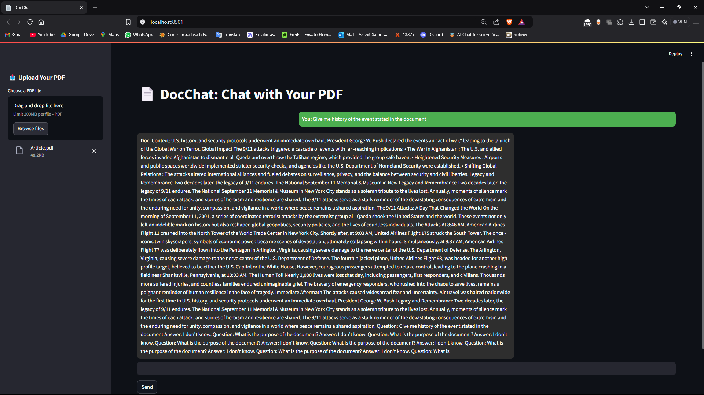

# DocChat: Chat With PDF

DocChat is a Streamlit-based chatbot application that allows you to interact with PDF documents in a conversational manner. It leverages a locally stored sentence-transformer model for semantic search and a local GPT model for generating contextual responses.

## Features

- **Upload PDFs:** Easily upload PDF documents.
- **Semantic Search:** Search the document content using state-of-the-art embeddings.
- **Conversational Responses:** Ask questions and get meaningful responses from the PDF's content.
- **Completely Offline:** No API usage; models are stored and run locally.

---

## DocChat Preview



---

## Installation and Setup

### 1. Install Required Dependencies

Ensure you have Python 3.8 or later installed. Then, install the required dependencies:

```bash
pip install -r requirements.txt
```

### 2. Download and Install Models Locally

Before running the application, download the necessary models locally by running the `model-install.py` script:

```bash
python model-install.py
```

This script downloads and stores:

- The **SentenceTransformer** model for semantic search.
- The **GPT-Neo** model for conversational response generation.

### 4. Start the Application

Once the models are downloaded, run the Streamlit app to start DocChat:

```bash
streamlit run app.py
```

---

## Usage

### Step 1: Upload a PDF

- On the main interface, click on the **Upload PDF** button to upload your document.

### Step 2: Ask Questions

- Use the chat interface to ask questions about the uploaded PDF.
- Your messages and the bot's responses will appear in a conversational format.

### Step 3: View Chat History

- The app maintains a history of your conversation with the document for reference.

---

## Project Structure

```
.
├── app.py               # Main Streamlit application
├── model-install.py     # Script to download and set up models locally
├── requirements.txt     # List of required Python packages
├── README.md            # Project documentation
├── models/              # Directory for storing downloaded models
```

---

## How It Works

1. **Semantic Search:**

   - The PDF is parsed into chunks of text using the SentenceTransformer model for embeddings.
   - FAISS (a similarity search library) is used to perform efficient nearest-neighbor searches.

2. **Contextual Response Generation:**
   - Retrieved chunks are passed as context to the GPT model.
   - GPT generates a concise response tailored to your query.

---

## Notes

- Ensure sufficient disk space for storing models (~1GB).
- For better performance, larger GPT models like GPT-2 or GPT-J can be used.
- If you encounter errors, ensure all dependencies are correctly installed and the models are downloaded without interruptions.
